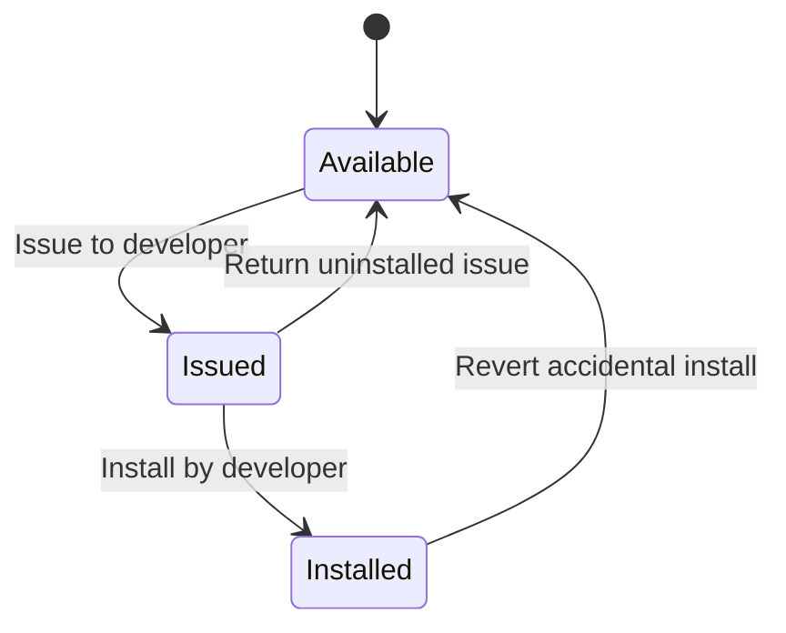

# Inventory Issuance, Install-on-Consume, and Revert

## Decisions (confirmed)
- **1A — Reserve on issue:** Total quantity stays unchanged; item is marked issued/reserved and blocked from other issue/install until returned or installed.
- **2A — Developer = any system user** selected at issue time (no new role).

## Current gap
Today, [`consume_inventory_unit`](c:\Project files\Jul-2026\plcm-backend\app\services\inventory_service.py) removes stock immediately on install/compose. `holder_user_id` is a soft field only. Report modes `issued` / `reserved` / `movements` are status-name heuristics or placeholders. There is no revert-install-to-stock API.

## Target lifecycle

| Action | Quantity total | Available for others | Ledger |
|--------|----------------|----------------------|--------|
| Issue | unchanged | decreases (reserved) | `issued` |
| Install | decreases | already reserved → consumed | `installed` |
| Return (before install) | unchanged | increases | `returned` |
| Revert (after install) | increases (same serial/PN) | increases | `reverted` |

## Backend

### 1. New `InventoryIssuance` ledger table
Add model/table (Alembic migration) with fields matching the tracking requirement:

- `inventory_id`, optional `inventory_instance_id` (serialized units)
- `quantity` (1 for instances; N for components)
- `issued_to_user_id` (developer), `issued_by_user_id`, `issued_at`
- Entity detail: `target_entity_type`, `target_entity_id` (optional planned install target), plus denormalized part/serial snapshots
- `status`: `issued` | `installed` | `returned` | `reverted`
- Install link: `installed_at`, `installed_entity_type`, `installed_entity_id`, `installed_by_id`
- Revert/return: `closed_at`, `closed_by_id`, optional `notes`

Wire into [`app/models/base.py`](c:\Project files\Jul-2026\plcm-backend\app\models\base.py), [`tables.py`](c:\Project files\Jul-2026\plcm-backend\app\models\tables.py), schemas, and relationships on `Inventory` / `InventoryInstance`.

### 2. Issuance service + APIs
New service (e.g. `app/services/inventory_issuance_service.py`) and routes under inventory (extend [`_10_inventory.py`](c:\Project files\Jul-2026\plcm-backend\app\routers\_10_inventory.py) or a sibling router):

| Endpoint | Behavior |
|----------|----------|
| `POST /inventory/{id}/issue/` | Create issuance; require available (non-reserved) qty/instance; set instance/component reservation |
| `GET /inventory/issuances/` | List/filter: developer, issuer, status, dates, part/serial, entity |
| `GET /inventory/issuances/{id}/` | Detail |
| `POST /inventory/issuances/{id}/return/` | Cancel uninstalled issue; clear reservation |
| `POST /inventory/.../consume/` (existing) | **Gate:** only consume available or the matching open issuance; on success mark issuance `installed` and link hierarchy entity |
| `POST /hierarchy/.../revert-to-inventory/` (new) | Soft-remove current install (or mark `is_current_install=false` per existing replacement pattern), call existing [`restore_inventory_unit`](c:\Project files\Jul-2026\plcm-backend\app\services\inventory_service.py) with **same serial + part number**, reopen/create issuance as `reverted`→available stock |

**Availability helpers:** `available_quantity = quantity - reserved_open_issuances`; for instances, open issuance on that instance blocks re-issue and blocks consume unless install references that issuance.

### 3. Change install paths to decrease only via install of issued (or auto-link) stock
Update consume callers so stock is not “free-for-all” once reserved:

- Backend `consume_inventory_unit`: reject reserved units unless `issuance_id` (or auto-match open issuance for that instance) is provided; after consume, flip issuance → `installed` and store installed entity ids.
- Frontend orchestration in [`lib/inventory-install.ts`](c:\Project files\Jul-2026\plcm-frontend\lib\inventory-install.ts), [`lib/hierarchy-create-form.ts`](c:\Project files\Jul-2026\plcm-frontend\lib\hierarchy-create-form.ts), [`lib/inventory-child-install.ts`](c:\Project files\Jul-2026\plcm-frontend\lib\inventory-child-install.ts), and replace dialogs: pass `issuance_id` when installing from an issued unit.

**Default rule:** Direct install from unreserved stock remains allowed (keeps existing maintenance/replace flows working). Reserved stock is installable only via its open issuance (typically by the assigned developer or a user with edit permission).

### 4. Permissions
Add (and sync in [`app/auth.py`](c:\Project files\Jul-2026\plcm-backend\app\auth.py) + frontend [`permission-codes.ts`](c:\Project files\Jul-2026\plcm-frontend\lib\permission-codes.ts) / role matrix):

- `issue_inventory` — create/return issuances (Admin/SubAdmin; optionally Technician)
- `revert_inventory_install` — accidental-install restore
- Keep `view_inventory` for listing issuances; `view_reports` for reports

No new Developer role — developer is a selected `User`.

### 5. Issuance report
Replace the heuristic `issued` mode and fill `movements` partially in [`report_service.inventory_report`](c:\Project files\Jul-2026\plcm-backend\app\services\report_service.py):

- New/real mode sourced from `InventoryIssuance`: columns **whom** (issued_to), **when**, **quantity**, **entity detail** (target + installed entity), **issued by**, status, part/serial
- Update schemas in [`schemas/reports.py`](c:\Project files\Jul-2026\plcm-backend\app\schemas\reports.py) and frontend reporting page columns

## Frontend

### 1. Issue UI on inventory
On [`app/(dashboard)/inventory/page.tsx`](c:\Project files\Jul-2026\plcm-frontend\app\(dashboard)\inventory\page.tsx):

- **Issue** action (gated by `issue_inventory`): pick serial/qty, developer (user select), optional target entity, notes
- Show reserved badge / available vs total on list rows and instance expanders
- Block “Use from inventory” pickers for reserved units unless selecting that issuance

### 2. Issuance monitoring
- New page or inventory tab: `/inventory/issuances` listing open/closed issuances with filters (developer, date, status, part/serial)
- Actions: Return (if `issued`), Install shortcut (navigate to parent install with issuance preselected), view entity after install

### 3. Install + revert
- Entity install / replace flows: prefer issued stock for the current user; send `issuance_id` on consume
- On hierarchy entity detail (system→component): **Revert to inventory** button (`revert_inventory_install`) that restores same serial/PN and clears current install linkage

### 4. Reports UI
Update [`reporting/inventory/page.tsx`](c:\Project files\Jul-2026\plcm-frontend\app\(dashboard)\reporting\inventory\page.tsx):

- Make **Issued Items** use the real issuance ledger (whom / when / qty / entity / issued by)
- Optionally add filters: issued_to, issued_by, status, date range

### 5. API client
Extend [`lib/api.ts`](c:\Project files\Jul-2026\plcm-frontend\lib\api.ts) + models for issuance CRUD, return, revert; surface `available_quantity` / `is_reserved` on inventory/instance reads.

## Implementation order
1. Migration + models + issuance service + issue/return/list APIs  
2. Gate consume + mark installed; availability on inventory reads  
3. Revert-to-inventory API using `restore_inventory_unit`  
4. Frontend issue dialog + issuances list + reserved UI  
5. Wire install/replace to `issuance_id`  
6. Revert button on entity pages  
7. Real issuance report mode  

## Out of scope
- New Developer/Installer roles  
- Changing compose-child consume behavior beyond respecting reserved children  
- Stock valuation / full WMS costing
